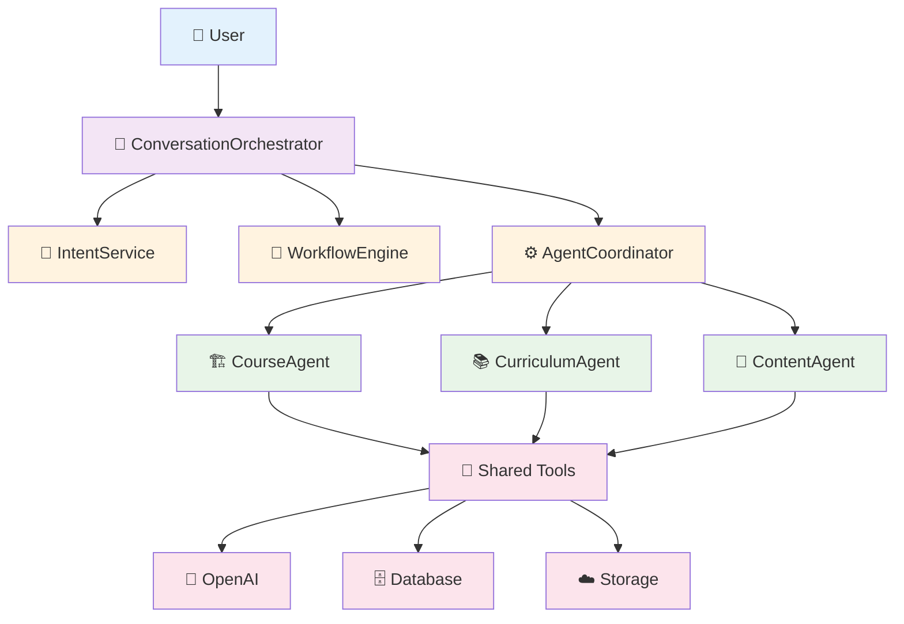
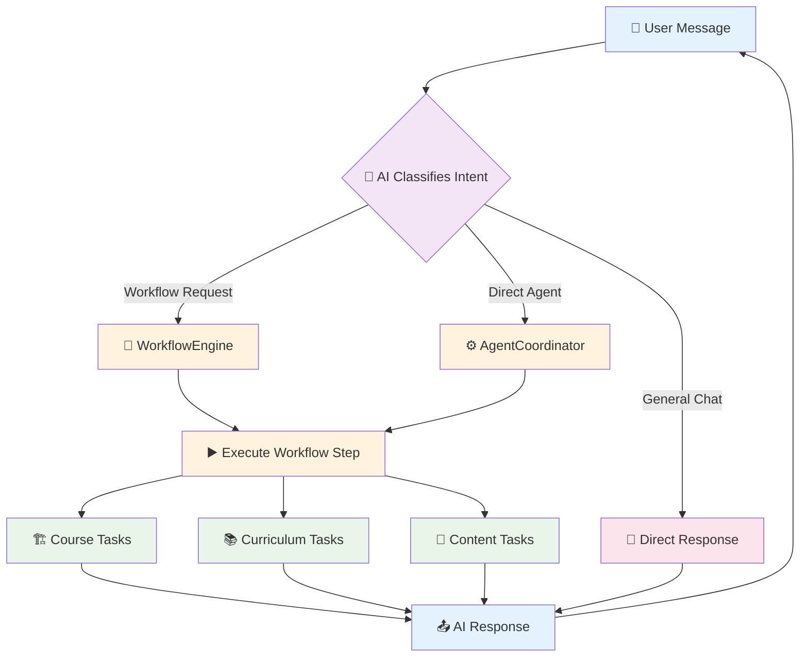

# Simple Request Flow Architecture - ProfessorAI

## 🏗️ **Clean Architecture Overview**



## 📝 **Simple Request Examples**

### **Example 1: "Create new course on Python"**
```
User → Orchestrator → IntentService (AI classifies as "workflow_request")
     → WorkflowEngine (AI decides "START_NEW_WORKFLOW") 
     → AgentCoordinator → CourseAgent → Creates course
     → Response: "Great! I've created your Python course. Ready for curriculum?"
```

### **Example 2: "Update slide 2 with AI research"**
```
User → Orchestrator → IntentService (AI classifies as "content_modification")
     → WorkflowEngine (AI decides "JUMP_TO_STEP: content_modification")
     → AgentCoordinator → ContentAgent → Updates slide content
     → Response: "Perfect! Slide 2 updated with latest AI research."
```

### **Example 3: "Yes, generate curriculum"**
```
User → Orchestrator → IntentService (AI classifies as "workflow_continue")
     → WorkflowEngine (AI decides "CONTINUE_CURRENT")
     → AgentCoordinator → CurriculumAgent → Generates curriculum
     → Response: "Excellent! Generated comprehensive curriculum with 8 modules."
```

### **Example 4: "What's the weather?"**
```
User → Orchestrator → IntentService (AI classifies as "general_query")
     → Direct AI response (no workflow/agents needed)
     → Response: "I focus on course creation. Need help with your course?"
```

## 🎯 **Simple Decision Flow**



## Key Architectural Principles

### 1. **Separation of Concerns**
- **ConversationOrchestrator**: Manages overall conversation flow
- **IntentService**: Classifies user intent using AI
- **WorkflowEngine**: Manages workflow logic and state
- **AgentCoordinator**: Routes requests to appropriate agents
- **Specialized Agents**: Handle domain-specific tasks

### 2. **AI-Powered Intelligence**
- **Intent Classification**: AI understands user requests
- **Workflow Decisions**: AI determines workflow actions
- **Conversational Responses**: AI generates natural responses
- **Content Generation**: AI creates course materials

### 3. **Dynamic Workflow Management**
- **Full Workflows**: Complete processes like course creation
- **Workflow Jumps**: Direct access to specific steps
- **Workflow Continuation**: Context-aware progression
- **State Persistence**: Workflow state maintained across sessions

### 4. **Scalable Agent Architecture**
- **Specialized Agents**: Each agent has specific domain expertise
- **Shared Tools**: Common services used by all agents
- **Dynamic Routing**: AI-powered agent selection
- **Easy Extension**: New agents can be added seamlessly

This architecture provides intelligent, flexible, and scalable course creation capabilities while maintaining clear separation of concerns and leveraging AI throughout the system.
